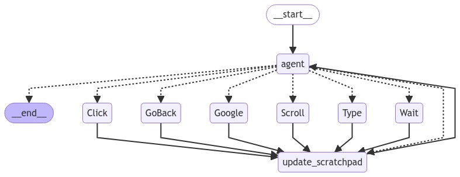

# Browser Agent

A browser automation agent built with Python, utilizing LangChain and LangGraph frameworks. This agent can perform autonomous web browsing tasks through a series of coordinated actions.

## Overview

This browser agent implements a flow-based architecture that allows it to autonomously navigate and interact with web pages. The agent's workflow is visualized in `agent_graph.png`.

## Architecture

The agent workflow consists of the following key components:

### Core Actions
- `_start`: Entry point for the agent workflow
- `agent`: Core decision-making component
- `update_scratchpad`: Updates the agent's memory/context

### Browser Operations
- `Click`: Handles element clicking operations
- `GoBack`: Manages browser back navigation
- `Google`: Performs Google search operations
- `Scroll`: Controls page scrolling
- `Type`: Handles text input
- `Wait`: Manages waiting operations

## Flow Diagram

The diagram shows the interconnected flow between different actions, with the agent making decisions based on the current context and webpage state.

## Prerequisites

- Python 3.8+
- LangChain
- LangGraph
- A compatible browser automation framework

